# Architecture

Процесс реализации проекта:

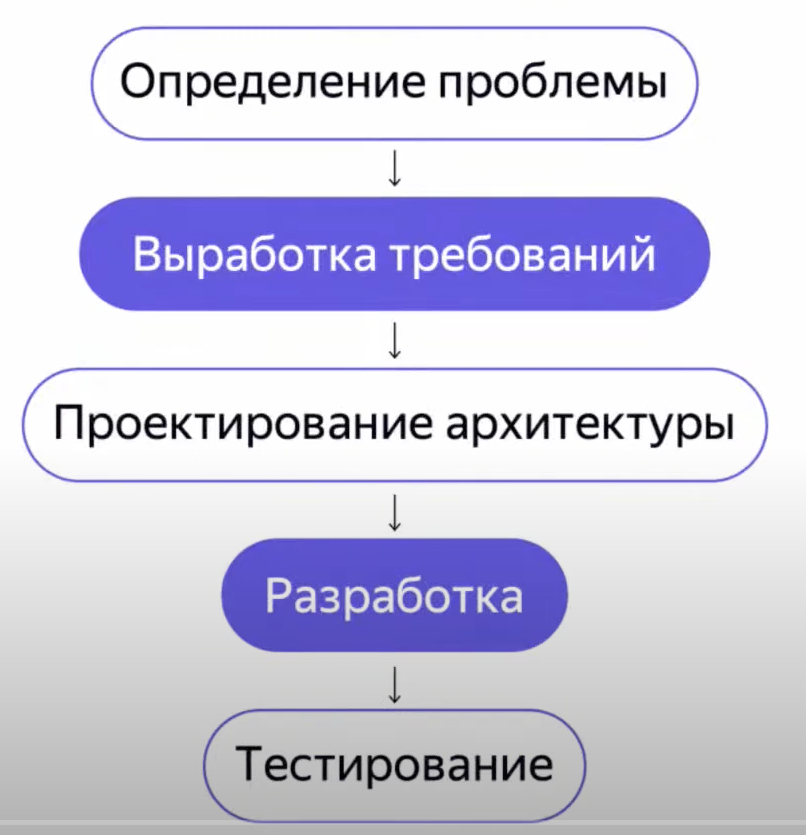

Чего хотим от хорошей архитектуры:

- расширяемость - время разработки нового функционала и изменения старого
  - низкая связность
  - переиспользуемость компонентов
- надежность - низкий шанс посадить баг при расширении/модификации
- тестируемость - простота написания тетсов и их качество
- простота поддержки - сколько нужно времени на то чтобы понять как работает система и как ее можно изменять

## Низкая связность

Инкапсуляция - хранение данных рядом с кодом, который работает с этими данными.

- приватные поля (приватные сеттеры)
- MutableList -> наружу торчит List
- internal классы - в рамках модуля

## SOLID

### Single responsibility

У каждого класса должна быть одна ответственность (причина меняться)

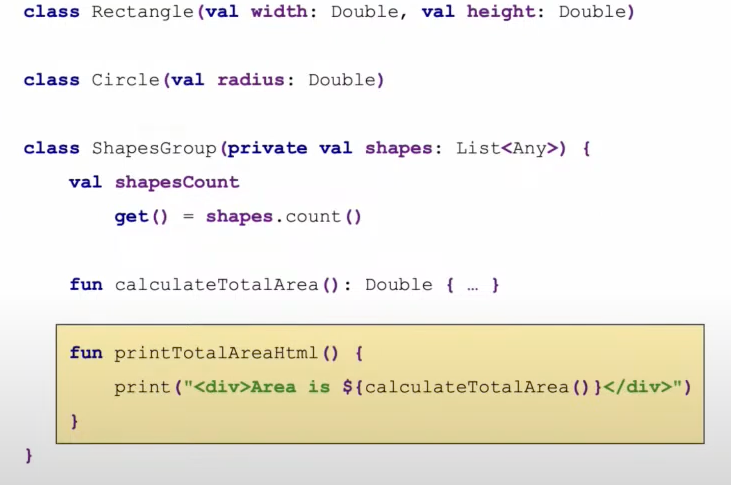

Single responsibility benefits:

- низкая связность - в каждом классе меньше функционала - у класса меньше зависимостей
- читаемость - маленькие классы проще читать и легче найти, где что происходит
- надежность - меньше возможностей посадить баг из-за того, что одна ответственность неожиданно влияет на другую
- тестируемость - нужно тестировать только одну ответственность

### Open/Closed

Классы и методы открыты для расширения, но закрыты для модификации.

Пример хорошего соблюдения open/closed:

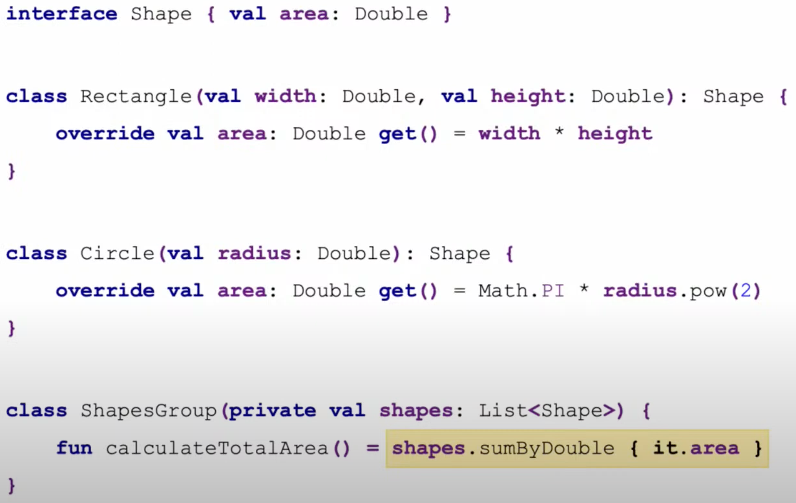

- подумайте как написать код так, чтобы потом его не приходилось постоянно менять
- если вы хотите, чтобы класс выполнял больше функций, допишите новые методы, а не меняйте старые
- используйте интерфейсы вместо конкретных классов
- используйте IoC

### Liskov substitution

Код не должен знать с какой реализацией работает. Поэтому реализации не должны вести себя неожиданно.

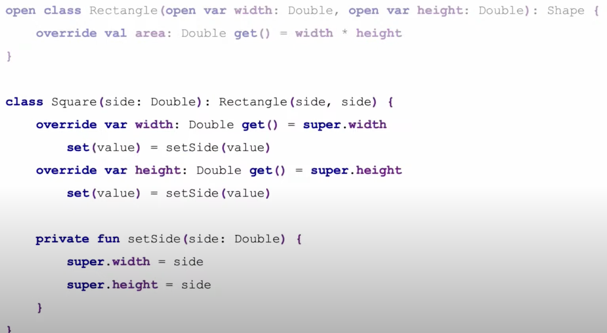

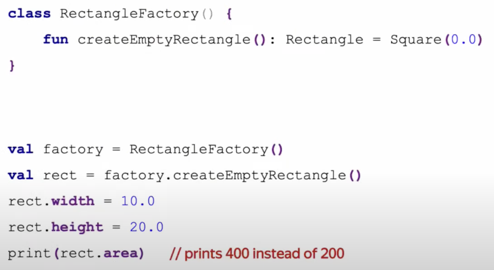

### Interface Segregation

Каждый класс должен реализовывать только те методы, которые ему нужны

- меньше кода - нет реализации лишних методов
- надежность - не будет неожиданностей от плохой заглушки

### Dependency Inversion

Высокоуровневые модули не должны зависеть от низкоуровневых. И те, и другие должны зависеть от абстракций.

## Inversion of Control

Чаще всего говорят про инверсию зависимостей. Класс, которому необходимы зависимости, не создает их сам, а получает извне.

Пример отсутствия IoC:

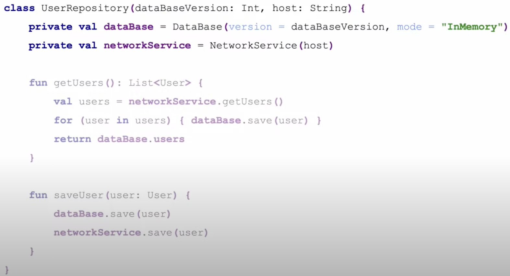

- нарушается single responsibility - класс занимается конфигурацией БД и сервиса
- нарушается open/closed - если меняется БД, то придется менять и репозиторий
- не получится использовать те же самые экземпляры БД и сервиса в других классах
- сложно тестировать - нужно будет как-то мокировать БД и сервис

Как исправить?

### Вариант 1: ServiceLocator

ServiceLocator - объект, отвечающий за создание экземпляров объектов. Он же может кешировать созданные экземпляры.

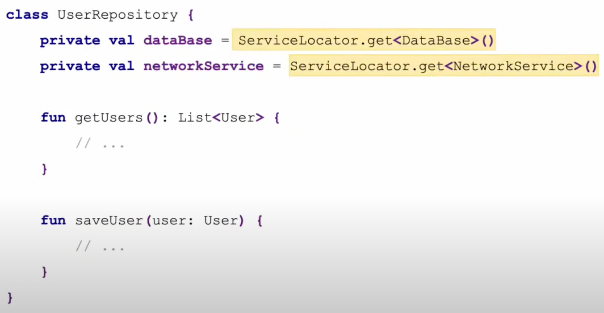

Все еще не удобно тестировать...

### Вариант 2: Dependency Injection

Все зависимости передаются извне, через конструктор.

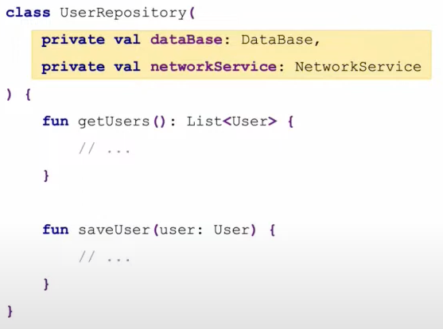

## Composition over inheritance

Нужно отказываться от наследования реализаций там, где это возможно.
С этим хорошо помогают котлин делегаты.

Когда нужно наследование?

- от интерфейсов
- от классов, которые вы не контролируете, если нет другого выбора

## Design Patterns

Design Patterns - типичные способы решения часто встречающихся проблем.

### Template Method

Нужно вывести похожие строки.
Выносим общую логику в абстрактный класс.
Реализацией занимаются классы-наследники.

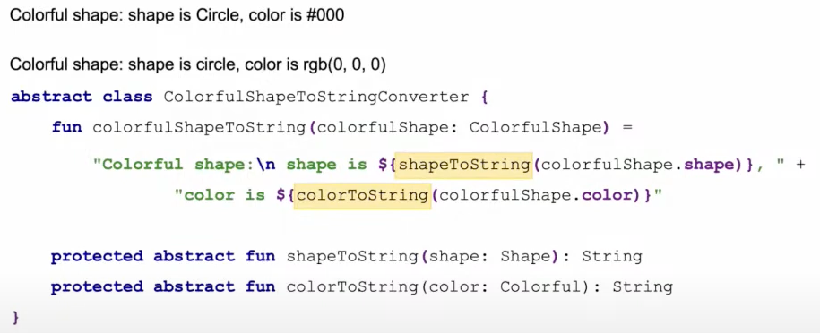

Template Method использует наследование, что хуже, чем композиция. Поэтому существует другой паттерн: стратегия.

### Strategy

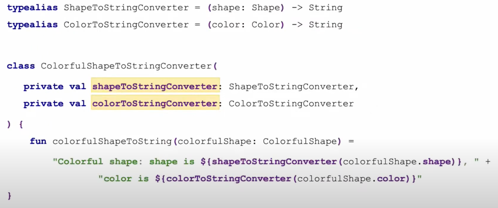

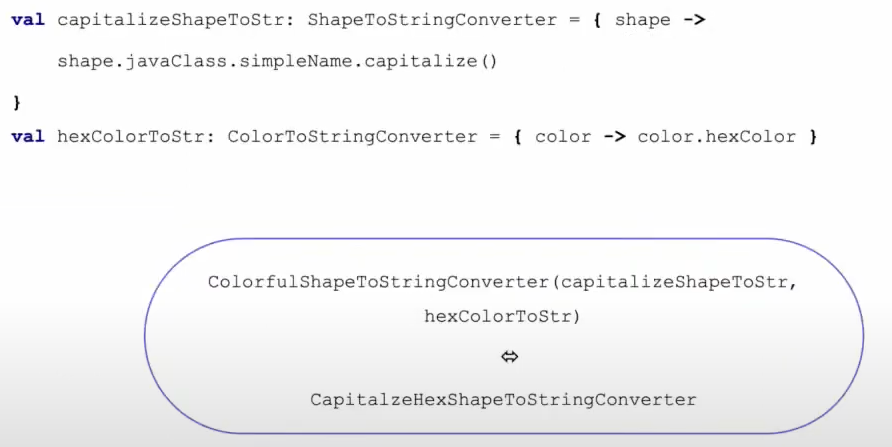

### Observer

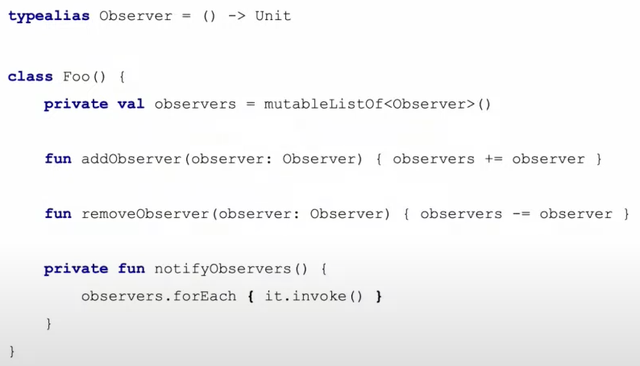

## Android arch

Data ничего не знает о Domain UI
Domain ничего не знает о UI

Похоже на клин.

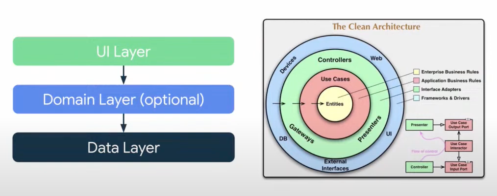

### UI

UI elements - activity, fragment, view
State holders - ViewModel, Presenter - не должно быть привязано к ЖЦ представления.

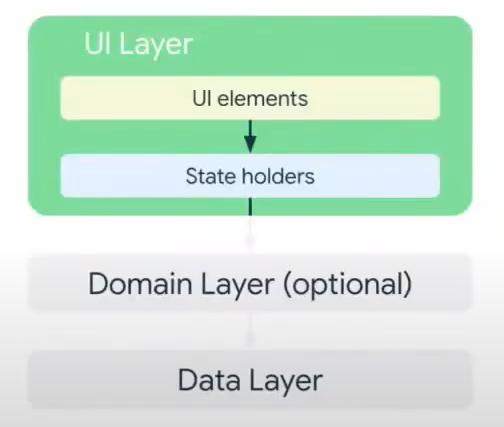

ViewModel Lyfecycle:

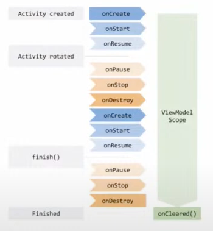

У вьюмодели, как и у активити, есть возможность сохранять данные в Bundle: SavedStateHandle. Это полезно, если приложение было выгружено из памяти и при возврате, вьюмодель могла прочитать сохраненные данные из бандла.

Как вьюмодель переживает пересоздание активити:

Вьюмодели хранятся в спец объекте и он сохраняется системой при изменении конфигурации. Потом из него можно достать вьюмодель.

Такой ЖЦ вьюмодели означает, что она не может держать ссылку на UI, иначе будет утечка памяти.

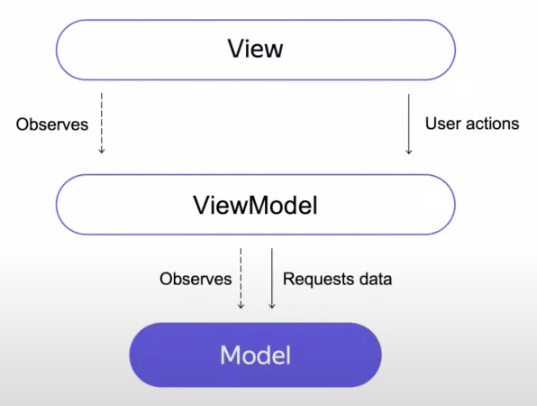

Какие события нужно обрабатывать во вьюмодели, а какие можно обрабатывать в UI коде?

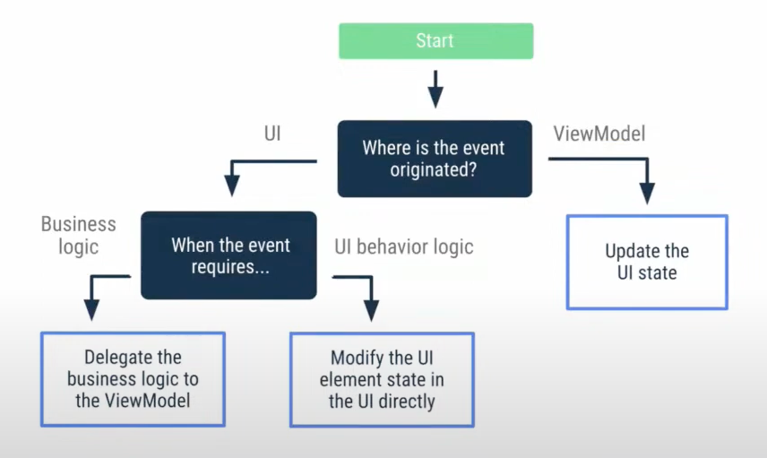

### Data

- Repositories - относится к какой-то одной сущности. Часто объединяет несколько источников данных. Данные которые возвращают из репозитория ничего не говорят об источнике, откуда они получены
- Data Sources - классы, кот загружают данные из интернета, БД...

### Domain

UseCase:

- не всегда нужен
- иммутабелен
- не хранит в себе состояние

### Обмен данными между слоями

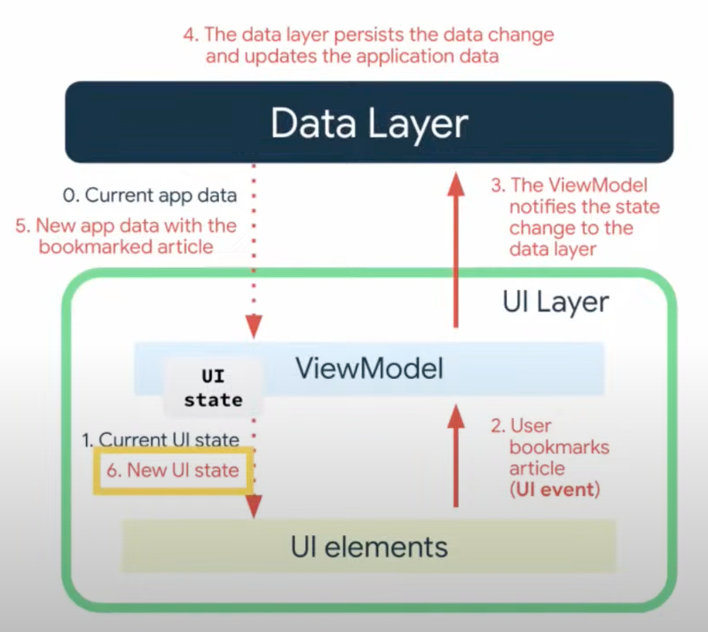

Unidirectional data flow
