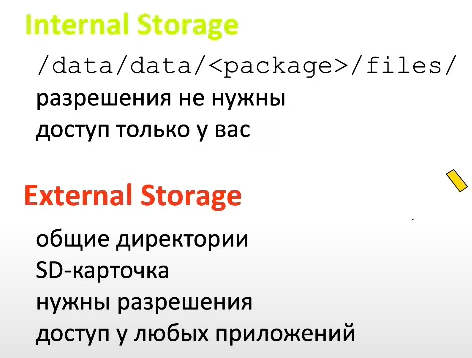

# Content provider

Content provider:

- часть манифеста
- представляет из себя CRUD сервис

Content resolver

- достается из контекста
- представляет из себя CRUD клиент

Как правило работа с CP - не всегда в рамках одного приложения.

- общаемся с ОС (манипулируем с фотографиями)
- пишем экосистему приложений

Почему работа с CP строится именно таким образом?

Любые межпроцессные взаимодействия ограничены в размере передаваемых данных. Нельзя отправить в интенте более 500 кб. Можно использовать AIDL сервисы, но там тоже ограничение на объем. А CP, за счет курсора, может передавать бесконечные объемы данных.

## Регистрация

authorities - будет видеть система из вашей АПК и регистрировать у себя. По authorities будет регистрироваться ваш CP. Поэтому важно, чтобы он был уникальным. Часто параметризуют пакетом приложения.

permissions - не стандартные разрешения, а специфичные для конкретного приложения. Можно использовать кастомные разрешения, для особой логики манипуляции с данными.

exported

- true - провайдер виден снаружи
- false - провайдер виден только изнутри. Очень редко используется. Пример: строим взаимодействие между двумя процессами в приложении, общение между которыми построено через контент провайдер.

## Cursor

Cursor - таблица. У него есть указатель на текущую строку, которую из него прочитали.

Cursor передает данные только в тот момент, когда двигается указатель. За счет этого и реализуется безлимитность передачи данных.

Работа с курсором

## Файловая система в Android

### до Android 10

### после Android 10

MediaStore API - для работы с медиа
Storage Access Framework - для работы с файловой системой

### App-specific работа с файлами

App-specific - все что нужно знать для работы конкретного приложения

- **Context.getFilesDir**() - старое внутреннее хранилище
- Context.getExternalFilesDir() - старое внешнее хранилище (SD карта)

---

- **Context.getCacheDir**() - может быть очищена, если системе не хватает памяти
- Context.getExternalCacheDir()

---

- Context.getNoBackupFilesDir() - файлы, сохраненные сюда, когда захотим сделать бэкап (перенос данных на новый телефон), не попадут в новый телефон
- Context.getCodeCacheDir() - директория для разработчиков игр

### Shared storage - MediaStore API

MediaStore API - набор ключей для контент резолвера

uri в данном случае - некий идентификатор ресурса, по которому нам пришлют outputStream, который мы сможем прочитать (если есть разрешение).
С самим файлом мы взаимодействовать не сможем. А вот стрим прочитать и записать - сможем, если это разрешено.

### Shared storage - Storage Access Framework

Дает доступ к файловой системе.

Пример:

Надо получить одну фотографию. Вызываем системный пикер. Пользователь выбирает там что-то. Нам приходит файл в ответ.

Другой вариант:

Мы можем быть провайдером данных, которые будут доступны в этом системном пикере.

Storage Access Framework представляет из себя:

- интенты с ключами - если мы обращаемся к данным
- DocumentsProvider : ContentProvider - если мы предоставляем данные
