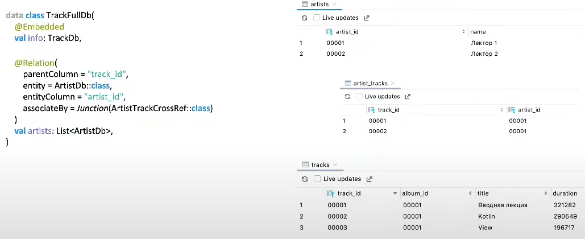

# Хранение данных

Что будем хранить?

- настройки приложения (темы итп)
- контент и информация
- польз. данные
- временные данные

Где хранить?

- облако
- файловая система
- БД (по-сути - тоже файловая система, но с определенной надстройкой)
- память (RAM)

Требования к хранилищу:

- размер и скорость передачи
- безопасность
- доступность (пропал интернет - хранилище недоступно)
- возможности поиска и анализа

Удаленные хранилища (облако):

- медленный доступ
- не всегда доступно
- данные могут перехватывать
- бесконечное по объему и с гибким доступом

Локальные хранилища (БД, файловая система ...):

- быстрое чтение
- всегда под рукой
- доступ к данным только у вас
- ограничен объем

БД - ваш друг. Это первый источник куда вы пойдете. Сеть - что-то второе. Но не всем приложениям необходимо хранить данные локально.

## Простые хранилища данных

### Shared preferences

key-value хранилище для примитивных типов данных:

- boolean
- int
- float
- long
- string
- string set

под капотом - xml  файл

prefs.edit(commit = false) {...} - вызов синхронный
commit = true - асинхронный

### Jetpack DataStore

- key/value хранилище
- поддерживает protobuf
- coroutines/rx из коробки

Jetpack DataStore по сути - тоже обертка над файлом

## Serialization vs Marshalling

Маршаллинг - процесс преобразования информации, хранящейся в оперативной памяти, в формат, пригодный для хранения и передачи.

Сериализация (подвид маршалинга) - процесс перевода структуры данных в последовательность байтов.

Как сериализовать?

- в JSON (работа с парсерами) - например: с помощью GSON
- пометить класс интерфейсом @Serializable

Такой объект можно:

- складывать в бандл
- записывать в файл через outputStream()

## Parcelable

Решили что Serializable - избыточный механизм - он хранит слишком много данных.

При работе с Bundle, при десериализации сохраняется проблема типизации. Если попытаемся прочитать неверный тип, то приложение упадет с ClassCastException. Если работаем с Parcelable - такой проблемы не возникает, тк под капотом вызов обернут в try/catch блок. Будет возвращен `null`, что, впрочем, может привести к неприятным багам.

Parcelable - интерфейс, который зависит от версии ОС. Поэтому не следует использовать его для долговременного хранения, например, для сохранения в файловую систему. А вот для передачи в интенте итп - вполне можно.

## СУБД

Классификация по моделям:

- иерархическая
- сетевая
- **реляционная** - SQLite
- **объектно-ориентированная** - Realm
- разнородная - NoSQL
- Big Data

ORM - object-relation mapping - Room (связывает реляционную и объектно-ориентированную модели данных)

## Room example

Музыкальный каталог

- каталог треков
- треки находятся в альбомах. в терминах реляционных бд реализуется отношение один ко многим: много треков - один альбом (Связь 1-N)
- У трека может быть множество исполнителей (Связь N-N)

### Шаг 1: Заводим таблицу альбомов

@PrimaryKey - каждая строка должна быть уникальна

### Шаг 2: Заводим таблицу треков

album_id должен совпадать с album_id из таблицы альбомов. Чтобы сказать об этом Room существует @ForeignKey аннотация.

Таким образом, устанавливаем связь 1-N

### Шаг 3: Заводим таблицу артистов

Теперь нужно установить отношение многие ко многим в контексте артистов и треков.

Такое отношение невозможно установить без создания промежуточной таблицы в Room.

### Шаг 4: создаем таблицу кросс-ссылок треков на артистов и наоборот

В этой таблице храним id  треков и их отношения к артистам. Благодаря этой таблице мы можем выбирать всех артистов, участвовавших в записи трека, либо все треки, в записи которых участвовал артист.

Путь построения взаимодействия:

### Шаг 5: создаем составные объекты: трек со всеми артистами

@Embedded - позволяет встроить в наш объект, готовый объект, не перечисляя каждую колонку.
В таком случае, по-сути, класс TrackFullDb будет выступать расширением над TrackDb.

Взаимодействие происходит следующим образом:

### Шаг 6: создаем DAO

DAO - паттерн проектирования. Чем-то похож на репозиторий. Разница в том, что DAO работает на более низком уровне. Он предлагает user-friendly интерфейс для работы с какой-то сущностью.

@Insert, Update, Delete, Upsert - аннотации для редактирования

@Query - полная выборка, выборка с условием.

Главная фишка Room -  глубокая интеграция с AS. Если неправильно написать запрос - упадет при компиляции. Еще строка поддерживает динамическое взаимодействие.

@RawQuery - особая выборка. Позволяет передать Query, который мы еще не определили.

### Шаг 7: собираем все DAO в одну БД

Важно перечислить все таблицы, в том числе и кросс-референсные.

### Шаг 8: создаем БД

Создание происходит через Builder.

Можно добавить конвертер типов. Зачем? В колонках SQLite можно хранить только набор определенных примитивных типов. Если хотим читать из базы не примитивы, а другие объекты (например: из числа сразу получать дату) - можно использовать TypeConverter. Не стоит использовать его для каких-то сложных типов.

allowMainThreadQueries() - может быть полезен для тестов. Никогда не включать на продакшене. Будем ловить ANR ошибки.

## Изменение схемы БД

Изменилось содержимое одной из таблиц. Нужно как-то обновиться без потери текущих данных.

Обновили таблицу. Теперь нужно как-то сказать Room, что у нас изменилась схема.

Есть автомиграции. Чтобы они запустились - нужно дописывать Build.gradle:

Каждая версия БД создает нам JSON-схему. В этом файле описывается вся структура БД. Эти версии нужно добавлять в гит.

Автомиграции сохраняют значения по-умолчанию.
Что, если нужно мигрировать как-то по-умному? (сходить в сеть, загрузить данные...)

Мы можем писать миграции вручную. Это крайне чувствительная часть приложения. 

Специфичный нейминг предлагается официально.
