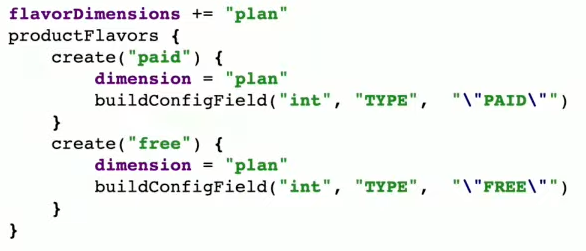
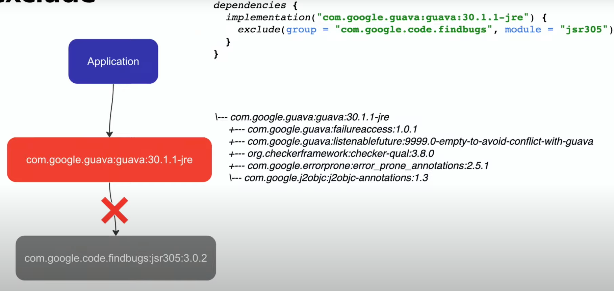

# Gradle

Этапы сборки проекта

- генерация `R.java` файла из ресурсов (aapt)
- компиляция исходного кода в байт-код (javac/kotlinc)
- трансляция байт-кода в dex формат
- упаковка результатов компиляции в .apk архив (aapt, zipalign)
- подпись .apk архива (jarsigner)

Gradle делает все это за нас

Преимущества Gradle

- базируется на JVM
- обладает высокой производительностью
- легко масштабируется
- легко использовать
- легко отлаживать
- имеет встроенную поддержку IDE

Зачем нам Gradle

- собирать проект
- запускать тесты
- удобно подключать сторонний код
- генерировать/трансформировать код
- обфусцировать код
- автоматизировать любую логику сборочного процесса

Gradle позволяет

- выполнять сборку параллельно
- кешировать информацию о сборке
- анализировать дерево файлов
- предоставляет удобное API для расширения
- базируется на JVM, позволяя использовать все готовые решения JVM мира

## Терминология

**Project** - сущность, которую собирает Gradle. Содержит скрипт сборки `build.gradle`, который декларирует Tasks, Plugins, Dependencies. Проект может содержать вложенные проекты.

**Task** - кусок логики сборки вашего проекта. Например: компиляция кода, запуск тестов, деплой.

**Plugin** - переиспользуемая логика конфигурации и сборки проектов. Позволяет использовать одни и те же таски для разных целей и избавляет от дублирования кода.

**Build** - сборка. Выполнение набора задач в проекте.

**Build phase** - этап ЖЦ сборки. (Инициализация, Конфигурация, Выполнение)

## Структура проекта

`gradle.properties` - настройки сборочной логики проекта. Также здесь можно настраивать любой плагин, подключаемый в проект.

`local.properties` - указывается по какому пути располагается android sdk. Нужно для того, чтобы при запуске сборки подтянулись все необходимые утилиты.

`settings.gradle.kts` - сердце проекта. Указываем какие модули, подпроекты, будут включены в сборку.


`build.gradle` (корневой)

```Kotlin
plugins{
  id("com.android.application") version "8.0.1" apply false
  id("com.android.library") version "8.0.1" apply false
}
```

`build.gradle` (внутри модуля)


## Kotlin DSL


- Каждый участок кода представляет собой DSL блоки, основанные на обычных kotlin/java классах с полями и методами

- при запуске Gradle загружает код скриптов сборки в свой JVM Classpath
- код выполняется последовательно сверху-вниз. Поэтому иногда важен порядок написанной конфигурации
- перед выполнением весь код сборки компилируется в JVM байт-код

## Android Gradle Plugin

Это плагин, который управляет сборкой Android проекта. То-есть это не сам Gradle, а отдельный плагин к нему.

**buildTypes** - способ создать исходный код по-разному


**product-flavores** - примерно такая-же возможность как и buildTypes, собрать ваш код по-разному. Можно использовать, например, для настройки платной/бесплатной версии приложения.



buildTypes и product-flavores формируют **buildVariant**


## Зависимости

- сторонний код(библиотека), подключаемый к коду вашего проекта (пример - Retrofit)
- сторонний код(библиотека), подключаемый к коду сборки вашего проекта (пример - Android Gradle Plugin)


Как подключить библиотеку?

- Показать откуда скачать

```Kotlin
repositories{
  google()
  mavenCentral()
  maven("https://plugins.gradle.org/m2/")
  maven("https://your.repository.com") {
    credentials {
      username = System.getEnv("REPO_USERNAME")
      password = System.getEnv("REPO_PWD")
    }
  }
}
```

- Показать как подключить

Указываем группу, имя и версию.


**implementation** - прямая зависимость
**api** - транзитивная зависимость


### Подключение библиотеки к проекту

```Kotlin
repositories{
  google()
  mavenCentral()
}

dependencies {
  implementation("androidx.core:core-ktx:1.8.0")
}
```

### Подключение библиотеки к сборке проекта

```Kotlin
buildscript{
	repositories {
		google()
		mavenCentral()
	}
	
	dependencies {
		classpath("androidx.core:core-ktx:1.8.0")
	}
}
```

### Проблемы при подключении зависимостей

- NoClassDefFoundError/NoSuchMethodError


Как бороться?

```Kotlin
configurations.all {
	resolutionStrategy {
		force("googleApi:1.0.0")
	}
}
```

- Duplicate class


Как бороться?

```Kotlin
dependencies {
	implementation("firebase") {
		exclude(group = "com.google", module = "googleApi")
	}
	implementation("googleCustomApi")
}
```

Exclude example:



## Многомодульность

Многомодульность - разделение кодовой базы на отдельные Gradle модули и правильная организация связи между этими модулями.


**Плюсы:**

- логическое разделение кода на независимые части
- меньше конфликтов при командной разработке
- возможность собирать разные target-ы приложений на единой кодовой базе (удобно для, например: демо-приложений, приложение для пользователей такси/самих таксистов)


- ускорение сборки *

Нужно включить параллелизм:

`org.gradle.parallel=true`


Пример:


Сначала соберется :core. Затем :feature-1, :feature-2 параллельно. Затем, когда все модули будут собраны, соберется :app.

Если бы :feature-1 зависел от :feature-2, то сборка еще бы замедлилась и превратилась бы в линейную. Без параллелизма. Следует избегать связей между фича-модулями.

Пересборка проекта


Изменения в :feature-1 вызовут пересборку только модулей :feature-1 и :app. Но изменения в :core вызовут пересборку всего проекта.

**Минусы многомодульности:**

- большой порог входа
- нужно следить за связями между модулями
- замедление сборки *

Настройка:

`settings.gradle` - добавить новые модули

Рекомендации по многомодульности:

- определите для какой цели разбиваете код проекта на модули
- избегайте прямой связи между feature модулями
- старайтесь делать так, чтобы от часто изменяемых модулей зависело как можно меньше других модулей
- делайте поменьше общих core модулей

Side effects:

- дублируются одинаковые зависимости в разных модулях
- дублирование кода конфигурации сборок
- рост времени конфигурации проекта - решается через подключение `org.gradle.configuration-cache=true`

### Проблема дублирования зависимостей


Варианты решения:

- шарить версии библиотек через `ext`
- `gradle.properties`
- `version catalog`

#### Version Catalog

- создать .toml файл с описанием зависимостей (можно в корне или любом другом месте)
- задекларировать Version Catalog в `settings.gradle`

```Kotlin
dependencyResolutionManagement {
	versionCatalogs {
		create("libs") {
			from(files("libs.toml"))
		}
	}
}
```

- использовать Version Catalog


теперь можно объявлять зависимости так:

```Kotlin
dependencies {
	implementation(libs.kotlin.android.ktx)
	implementation(libs.android.appcompat)
}
```

В `.toml` файле можно добавить блок `[bundles]` и подключать несколько зависимостей одной строкой

```Kotlin
dependencies {
	implementation(libs.bundles.feature.deps)
}
```

gradle plugins тоже можно описать в `.toml` файле


Version Catalog

- удобный способ шаринга зависимостей
- позволяет публиковать свои .toml файлы и шарить между командами
- прост в использовании

### Проблема дублирования конфигураций (в больших проектах)

- файлы конфигурации сборки начинают во многом дублироваться


- конфигурация сборки и доп логика сборки начинают смешиваться, усложняя поддержку


#### Convention plugins


Во внутреннем `settings.gradle`:

```Kotlin
depndencyResolutionManagement {
	versionCatalogs {
		create("libs") {
			from(files("../libs.toml"))
		}
	}
	repositories {
		google()
		mavenCentral()
	}
}
```

В `build.gradle.kts`:

```Kotlin
plugins {
	`kotlin-dsl`
}

dependencies {
	implementation(libs.agp)
	implementation(libs.kotlin.gradle.plugin)
	implementation(files(libs.javaClass.superclass.protectionDomain.codeSource.location)) // hack как сделать так, чтобы внутри convention плагинов работал Version Catalog
}
```


Теперь настройка фичи выглядит следующим образом:


## Gradle Wrapper

Gradle Wrapper - обертка над Gradle. Рекомендуемый способ работы с Gradle, необходимый для быстрого начала работы с системой сборки без предварительной переустановки. Позволяет привязать проект к конкретной версии Gradle и легко обновлять версию.


Схема работы Gradle Wrapper:


Преимущества:

- очень легко использовать Gradle, без предварительной устрановки
- стандатризируем сборку проекта на конкретную версию Gradle, делая сборку стабильной и надежной
- можем гибко и быстро переключать версию Gradle для нашего проекта

## Gradle Daemon

Демон - это компьютерная программа, которая запускается как фоновый процесс, а не находится под непосредственным контролем пользователя.

Gradle Daemon - это долгоживущий фоновый JVM процесс, который сокращает время сборки и конфигурации проекта. Может сократить время сборки на 15-75% при повторной сборке одного и того же проекта.

Преимущества:

- кеширует информацию о проектах между разными сборками
- работает в фоне, поэтому при запуске сборки, не тратится время на инициализацию JVM
- наблюдает за изменениями файловой системы проекта, чтобы расчитывать изменения файлов перед стартом сборки

Схема работы:


После завершения сборки, демон остается жить в фоне.

Демон можно конфигурировать.

В `gradle.properties`

```Kotlin
org.gradle.daemon=true
```

Принудительная остановка всех демонов:

```Kotlin
./gradlew -stop
```

## ЖЦ сборки

- инициализация
	- анализируется `settings.gradle.kts` файлом и определяется какие проекты включены в сборку
	- создается экземпляр класса `Project` для каждого проекта
- конфигурация
	- анализируется сценарий сборки из `build.gradle.kts` каждого проекта
	- создается граф задач для каждого проекта. Направленный ациклический граф (DAG)
- выполнение
	- планируется и выполняется каждая задача из построенного ранее графа

### DAG

Сборка Gradle основана на задачах, описанных в скриптах сборки и зависимостях между этими задачами. Это гарантирует, что все задачи вашей сборки будуь выполняться ровно в порядке их зависимости друг от друга.

Скрипты сборки проекта и подключаемые плагины настраивают эти зависимости, формируя направленный ациклический граф (DAG).


### Инициализация

`settings.gradle.kts`

- поиск всех проектов, включенных в сборку через `include`
- поиск всех вложенных композитных проектов через `includeBuild`
- декларация зависимостей на уровне сборки, подготовка проектов к запуску сборки


### Конфигурация

`build.gradle.kts`

- оценка сценариев сборки
- регистрация задач для будущего исполнения
- построение графа выполнения задач
- присвоение свойств всем зарегистрированным задачам


### Исполнение

- исполнение логики зарегистрированных задач на основе построенного графа


## Gradle Task

Gradle Task - кусок логики, который выполняется в момент сборки проекта. Задачи могут выполнять разные действия: сборка .apk файла, запуск тестов, установка приложения на устройство, выгрузка .apk из маркета итд

Gradle Task состоит из списка Action-ов, которые исполняются последовательно в порядке очереди.

Создание Gradle Task:

(так писать таски не стоит)

```Kotlin
tasks.register("myTask") {
	println("register my task") // выполнится на этапе конфигурации
	dofirst {
		println("run first")
	}
	doLast {
		println("run last")
	}
}
```

(а так - стоит)

```Kotlin
tasks.register("myTask", MyTask::class) {
	println("register my task") // выполнится на этапе конфигурации
	messageProperty.set("TestMessage")
	doFirst {
		println("Run before")
	}
	doLast {
		println("Run after")
	}
}

abstract class MyTask : DefaultTask() {
	@get:Input
	abstract val messageProperty: Property<String>
	
	@TaskAction
	fun execute() {
		println("Message = ${messageProperty.get()}")
	}
}
```


### Custom Gradle Task

```Kotlin
abstract class MyTask : DefaultTask() {

	@get:Input // входные данные
	abstract val messageProperty: Property<String>

	@TaskAction // важно чтобы стояла эта аннотация
	fun execute() {
		println("Message = ${messageProperty.get()}")
	}
}
```

#### Ленивая конфигурация

По мере усложнения сборки становится трудно следить за тем, что, где и когда вызывается. Для решения этой проблемы, Gradle предоставляет lazy configuration api для настройки отложенной конфигурации проекта и обращения к свойствам проекта по мере их вызова.

`abstract val messageProperty: Property<String>` - отложенные свойства

`tasks.register("myTask", MyTask::class) {}` - отложенное создание задач

Регистрация задачи не создает экземпляр задачи. Она регистрирует ее в графе. Экземпляр создается момент построения графа задач.

#### Gradle task inputs (входные данные)

```Kotlin
@get:Input
abstract val messageProperty: Property<String>

@get:InputFile
abstract val fileInput: RegularFileProperty

@get:InputFiles
abstract val filesInput: ConfigurableFileCollection

@get:InputDirectory
abstract val directoryInput: DirectoryProperty
```

#### Gradle task outputs (выходные данные)

```Kotlin
@get:OutputFile
abstract val fileOutput: RegularFileProperty

@get:OutputFiles
abstract val filesOutput: ConfigurableFileCollection

@get:OutputDirectory
abstract val directoryOutput: DirectoryProperty
```

### Порядок выполнения задач


Задачи в графе не связаны и Gradle пытается выполнить их параллельно. Как пофиксить?

```Kotlin
publish.mustRunAfter(build)
// or
publish.dependsOn(build)
//or
publish.configure<PublishTask> {
	apkFileProperty.set(build.apkFileProperty)
} // связали входные данные publish с выходными данными build
```

## Gradle Plugin

Gradle Plugin - способ упаковки сборочной логики в отдельную переиспользуемую сущность (plugin). Позволяет конфигурировать параметры сборки, подключать зависимости, регистрировать новые задачи и задавать порядок их выполнения. Плагины можно использовать во множестве проектов и сборок. Можно подключать к сборке как свои собственные плагины, так и сторонние.

**Где расположить Gradle Plugin?**

- в отдельном проекте и распространять в виде jar библиотеки
- в директории buildSrc
- в includedBuild проекте


### Работа с AGP


Можно регистрировать свои extension-ы:


