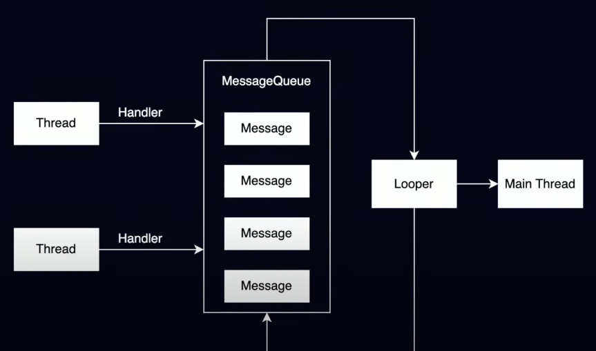
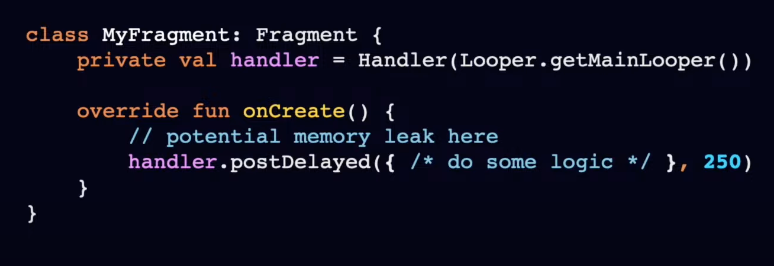
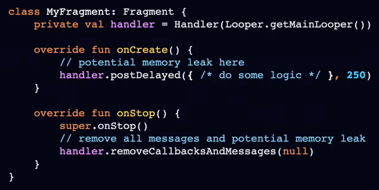
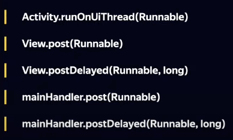
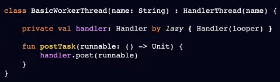
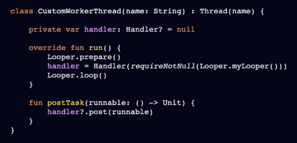

# Handler/Looper/Message Queue

**Handler**:

- обработчик сообщений для потока
- предоставляет интерфейс для фоновых потоков для отправки сообщений в main thread.

**Looper** - диспетчер сообщений. Вытаскивает задачи из MQ и передает их на обработку Handler-у.

**Message Queue** - неограниченный по размеру буфер сообщений.

## Memory leaks

## Как не допустить утечек?

## Отправка сообщений на main thread

## Свой Worker Thread

или

