# View

Зачем изучать если есть Compose:

- большинство проектов все еще на View
- Compose - Kotlin-only
- Серьезные различия в навигации
- Различия в ЖЦ

Стандартные View:

- android.widget - стандартная библиотека Android (TextView, Button ...). Не нужно подключать отдельной зависимостью.

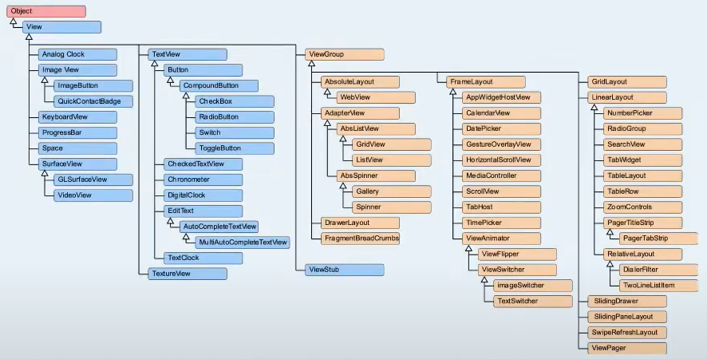

Основные View из `android.widget`:

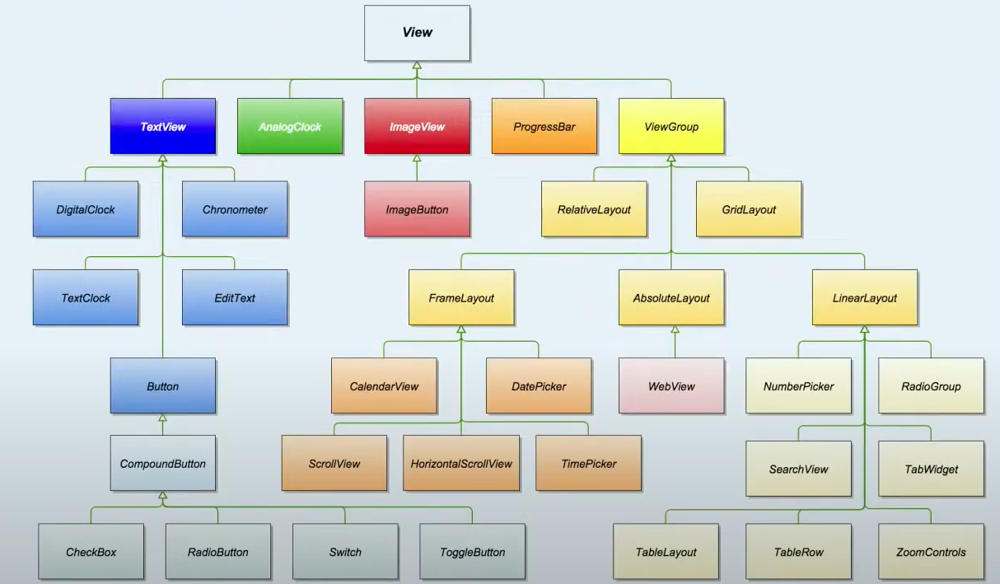

- AppCompat (androidx.appcompat.widget) - поддержка совместимости
- Material Design - попытка привести все компоненты к единому стилю. Под капотом использует appcompat

Задача: отрисовать экран авторизации

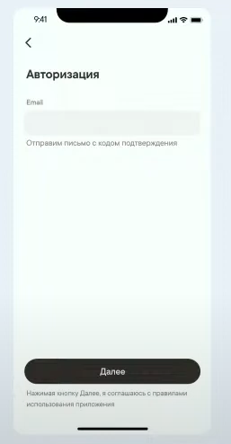

Заголовок - подойдет TextView

Как добавить?

- XML - через теги задаем объекты и свойства для объектов
- программно

Атрибуты:

id - уникальное значение для View в текущем XML. Нужен, чтобы мы могли обратиться к View в коде.

Layout файлы:

Это xml-файлы, определяющие интерфейс приложения или его часть.

- setContentView() //Activity.onCreate()
- должен иметь одну корневую вью

## RTL

Для отображения контента телефона справа-налево (актуально для арабского и др. языков), начиная с API 17 ввели поддержку RTL.

Left-to-right/Right-to-left -> Unified

marginLeft/marginRight -> marginStart

marginRight/marginLeft -> marginEnd

итп...

---

ViewGroup.LayoutParams - говорит родителям (контейнер) как расположить дочернюю вью внутри себя.

## ViewGroup

ViewGroup - особое View, которое может хранить дочерние View.

Задачи:

- Расположение дочерних вью в заданном порядке
- Диспетчеризация касаний (motion events)
- Базовый класс для контейнеров (api)

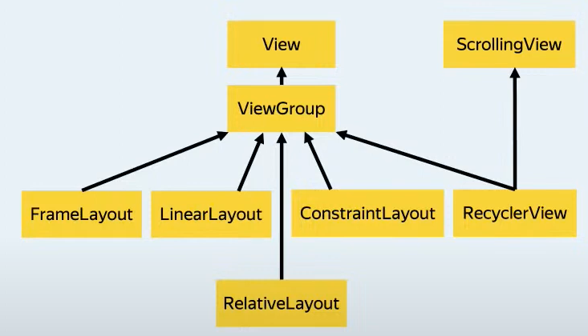

### FrameLayout

- Это стек с дочерними вью, которые накладываются друг на друга в порядке очередности объявления/добавления
- самый легковесный контейнер
- layout_gravity - расположение дочерней view в контейнере

Применение:

- отрисовка простого экрана
- попеременное появление нескольких вью

### LinearLayout

- orientation: vertical/horizontal
- weight

Применение:

- Упорядочение своих детей горизонтально или вертикально
- Расположение элементов без размеров

### RelativeLayout

- устаревшая версия ConstraintLayout
- управление дочерними вью через атрибуты: layout_alignParentBottom, layout_above etc

Применение:

- гибкое расположение View без большой вложенности
- осталось как легаси

### ConstraintLayout

- гибкий инструмент позиционирования
- управление дочерними вью через атрибуты: layout_constraintTop_toBottomOf etc
- подключается отдельной библиотекой (API >= 9)

Применение:

- позиционирование сложных экранов без большой вложенности

## View lifecycle

parent calls addView()

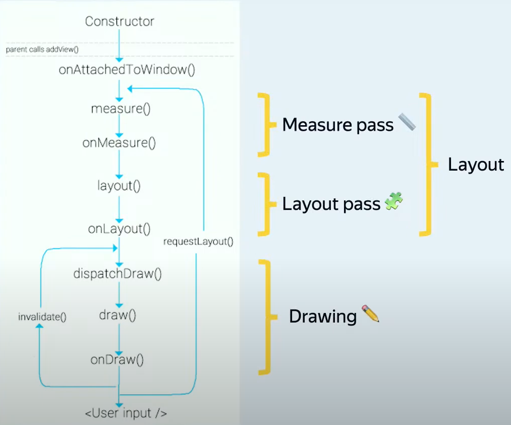

### Layout этап

- measure pass - обсчет размеров вью. Переопределяем onMeasure()
  - Проходим по дереву контейнера сверху вниз
  - Родитель передает детям требования к размерам (Measure Spec)
  - View рассчитывает размеры и сохраняет во внутренний стейт (measuredWidth, measuredHeight)
  - Повторный пересчет из-за нехватки данных для расположения внутри контейнера. Обычно бывает у LinearLayout когда мы задаем размеры вьюшек через weight

- layout pass - позиционирование вью внутри вьюгруппы
  - Проходим по дереву контейнера сверху вниз
  - знаем размер всех вьюх
  - Переопределяем onLayout() для переопределения метода позиционирования дочерних вью

### Drawing этап

- отрисовка
- переопределяем onDraw() для переопределения метода отрисовки вью

### requestLayout

Пересчет размеров и позиций всего дерева вью (частое использование негативно влияет на работу с приложением). Вязов onDraw() не гарантирован

Может понадобиться при изменении отступов

### invalidate

Перерисовать вью без изменений размеров и положения

Может понадобиться при изменении бэкграунда

Методы requestLayout и invalidate не запускают перерисовку немедленно. Они лишь устанавливают флаг, говорящий системе, что что-то изменилось.

## Touches

Кто обработает Touch Event, если onClickListener-ы висят на ViewGroupA, ViewGroupB, View?

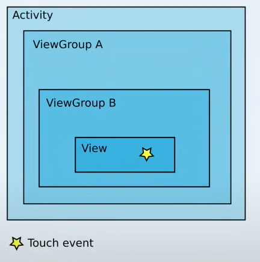

Ответ: View!

MotionEvent - сообщение о событии жеста.

Содержит:

- координаты события
- данные о силе нажатия
- тип события

### Обработка кликов

- `View.onTouchEvent(ev: MotionEvent): Boolean` - обработка события для данной вью.

  Возвращаемое значение сообщает:
  - перехватила ли вью сообщение
  - будет ли вью перехватывать дальнейшие события в рамках текущего события перемещения

- `ViewGroup.onInterceptTouchEvent(ev: MotionEvent): Boolean` - отслеживание событий происходящих на поверхности ViewGroup (в тч и дочерних вью) и их перехват

  Возвращаемое значение сообщает:
  - перехватила ли вьюгруппа события
  - прокинет ли вьюгруппа событие дальше по иерархии

Схема перехвата событий для примера:

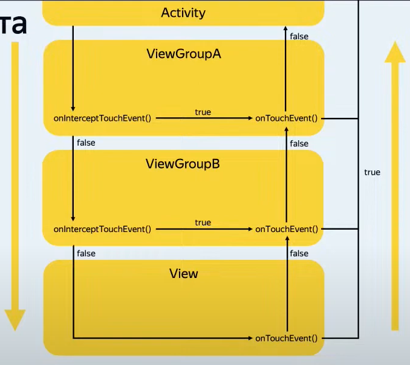

Обработка тачей:

- вручную, переопределяя onTouchEvent()/onInterceptTouchEvent()
- GestureDetector

Шаги работы с GestureDetector:

- переопределяем onTouchEvent() у вью
- переопределяем колбеки GestureDetector.OnGestureListener
- отправляем каждое событие в GestureDetector
- GestureDetector определяет какое событие произошло
- обрабатывается соответствующий колбек

## Performance/Debugging

- 60 fps (16 мс)
- android сам перерисовывает экран через onDraw()

onDraw()

- не создавать объекты в onDraw()
- не производить сложных вычислений

OverDraw - отрисовка одного пикселя экрана несколько раз (проблемы с иерархией)

для отслеживания overDraw:

- debug GPU
- Layout Inspector
- Profile GPU

как избежать overDraw:

- удалить невидимые бэкграунды в layout
- упростить иерархию вью
- уменьшить прозрачность вью

## RecyclerView

RV - инструмент для эффективного отображения больших наборов данных

в базовом варианте включает:

- ViewHolder
- Adapter
- LayoutManager

Кастомизация:

- ItemAnimator
- ItemDecoration
- ... ~ 25 классов и интерфейсов

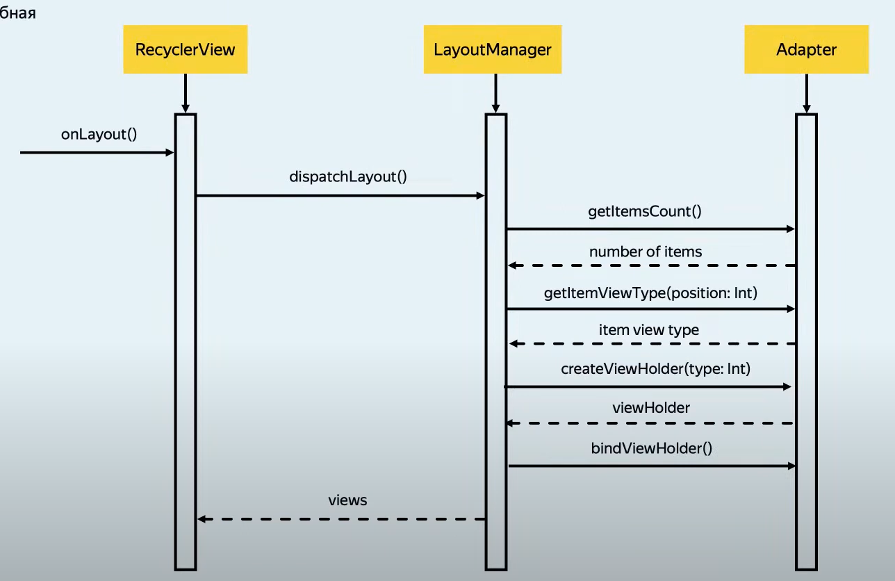

Шаги по имплементации RecyclerView:

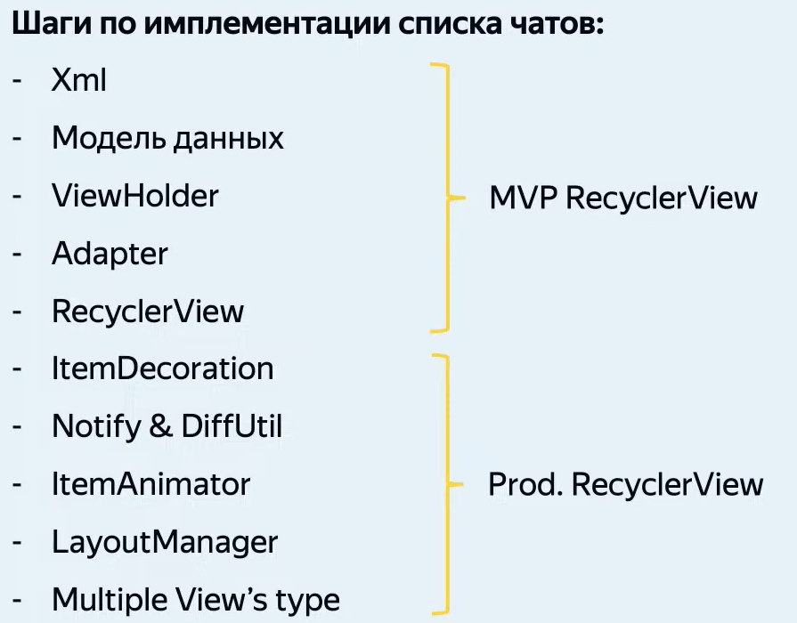

### ViewHolder

VH - класс, который содержит ссылку на представление (View) элемента в RV. По сути - это обертка над вью.

Задачи:

- хранить ссылку на вью
- хранить метаданные о расположении вью в RV
- привязывать данные из модели данных в представление

### Adapter

Адаптер между набором данных и их представлением

Adapter:

- абстрактный класс
- обобщенный тип
- RecyclerView.Adapter

LayoutInflater - преобразует xml во вью
layoutinflater.inflate(id: Int, parent: ViewGroup, attachToRoot: Boolean)
параметр attachToRoot всегда нужно выставлять в false для RV. Т.к. RV сам добавляет вью в список

### LayoutManager

Помимо обсчета вью, у LayoutManager есть функция ресайклинга вью и их переиспользования при скролле.
За счет этого onCreateViewHolder() вызывается гораздо реже, чем onBindViewHolder().

Ключевые методы LinearLayoutManager:

- onLayoutChildren() - позволяет отобразить все свои айтемы
- scrollVerticallyBy() - возвращает на какое количество пикселей можно проскроллиться
- scrollHorizontallyBy() - то же самое по горизонтали

### DiffUtil

Служебный класс, созданный для улучшения производительности RV при обновлении списка

Задачи:

- определяет, изменилось ли положение элемента в списке
- определяет изменились ли данные в одном и том же элементе
- определяет данные в элементе, которые были изменены

Просчет изменений DiffUtil-ом можно вызывать на любом потоке.

### ItemAnimator

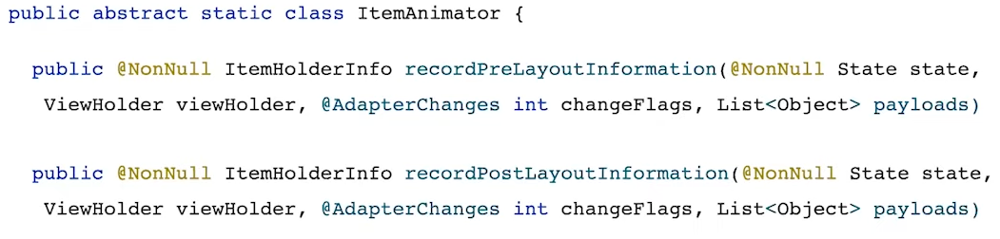

Как работает анимация?

Когда вызываем notify() происходит два лейаутинга:

- Первая фаза - лейаутинг айтемов как они есть. В этот момент, для всех вьюхолдеров на экране будет вызван ItemAnimator.recordPreLayoutInformation().
- Вторая фаза - айтемы в измененных позициях. Для всех вьюхолдеров на экране будет вызван ItemAnimator.recordPostLayoutInformation().

### ItemDecoration

Позволяет добавлять отрисовку для RV и отступы определенным элементам списка

Задачи:

- отрисовка поверх RV - onDrawOver()
- отрисовка под RV - onDraw()
- проставление отступов между элементами списка - getItemOffset()

При рисовании, лучше использовать координаты x, y, вместо left, top, bottom ... Поскольку айтем может находиться в состоянии анимации.

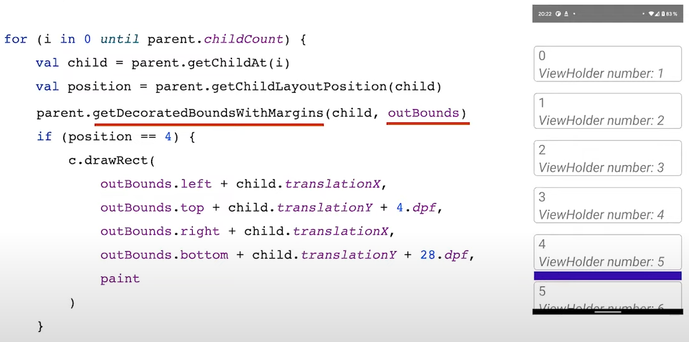

getDecoratedBoundsWithMargins() - вернет границы со всеми оффсетами, в том числе и заданными другими декораторами.

### Payload

Предоставляет возможность изменения содержимого элемента, без его полной перерисовки

### Prefetch

Механизм предзагрузки следующих элементов в списке.

### SnapHelper

Механизм доскролла списка

### RecycledViewPool

Класс, который хранит в себе ссылки на вью, для их переиспользования.

Внутри RV ViewHolder-ы переиспользуются, чтобы не нагружать UI поток, не создавать лишние вью итп...

RV позволяет переиспользовать ViewHolder и View не только внутри одного RV, но и между несколькими.

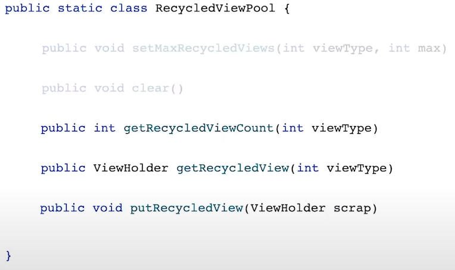

Как работает?

Есть RV. В момент, когда он исчезает с экрана, нужные айтемы сохраняются в RecycledViewPool. Когда появляется этот же RV или другой, айтемы нужных типов выдергиваются из пула и переиспользуется. Не будут создаваться новые вьюхолдеры, а будут использоваться старые.

Вьютайпы у айтемов для разных адаптеров должны совпадать!

Нужно не забывать вызывать метод clear() у RecycledViewPool. Т.к. жц не определен и можно получить утечки памяти, тк хранятся ссылки на вью.

Особенности:

При установке адаптера в RecyclerView.setAdapter() RecycledViewPool автоматически очищается. Чтобы он не очищался, нужно использовать RecyclerView.swapAdapter()

### ListAdapter

Расширение базового класса, в которое встроен DiffUtil. Выполняет операции сравнения на фоновом потоке. Это не всегда эффективно, например в случае, когда переключение на другой поток дороже, чем сама операция сравнения.
