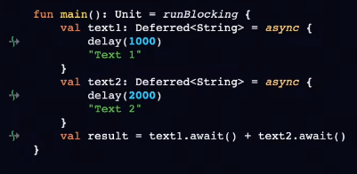
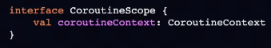
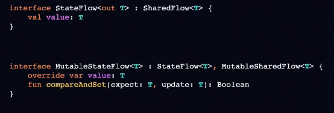

# Coroutines

C - экземпляр приостанавливаемых вычислений.

- похожа на поток
- позволяет приостановить выполнение кода и возобновить его позже
- когда приостановлена - поток не блокируется и готов выполнять другие задачи

Фичи:

- соблюдает принципы Structured Concurrency - построение взаимодействия между родительской корутиной и дочерней. Есть возможность организовывать связи между корутинами.
- имеет встроенную поддержку отмены задач
- поддерживает обработку исключений
- полностью интегрированы в Android Jetpack

Другая реализация прошлого примера на потоках:

`suspend` функция - основание для компилятора пометить что-то в байткоде. Сами эти функции не являются корутинами.

Просто так вызвать `suspend` функцию не получится. Ее можно вызвать только из другой `suspend` функции. Чтобы решить данную проблему есть **CoroutineBuilder**.

## CoroutineBuilder

CB - мостик между обычным миром и `suspend` миром.

- launch - запуск корутины, результат не важен

- async - умеет возвращать результат

- runBlocking - не требует скоупа для запуска. Может быть вызван из любой функции. Блокирует поток на котором был запущен.

`launch` и `async` - extension функции к CoroutineScope. Без доступа к скоупу их не вызвать.

## CoroutineScope

CS - скоуп запуска корутины. Откуда она будет запущена. Входная точка в корутину. Ограничивает область действия корутины.

CS:

- входная точка в корутины
- следит за всеми дочерними корутинами
- имеет возможность отменить работу дочерних корутин
- содержит CoroutineContext

Запуск корутины:

`launch` - возращает Job

`async` - Deffered

Job:

- абстракция над жц работы
- имеет функцию отмены
- является частью CoroutineContext

## CoroutineContext

CC - универсальный способ группировать и передавать объекты, состояния между корутинами. Определяет поведение корутин. Передается от родителя к дочерней корутине.

Каждый эл-т контекста имеет уникальный ключ, кот. помогает идентифицировать его внутри этого контекста.

Базовые элементы контекста:

- Job
- CoroutineName
- CoroutineDispatcher
- CoroutineExceptionHandler

Элемент контекста сам по себе является контекстом.

На каждую новую корутину создается свой инстанс Job, который наследуется от parent Job.

## Big picture

 У нас есть CoroutineScope.

 Есть CoroutineBuilder, который требует CoroutineScope.

 В рамках CoroutineBuilder создаются корутины, которые работают в suspend функциях, либо в обычных. Можем вызывать CoroutineScopeBuilders - это спец функции, которые позволяют настраивать работу со скоупом.

 Пример CoroutineScopeBuilders:

- coroutineScope - хорошо помогает, если нужно создать несколько асинхронных корутин 
- withContext - нужен, чтобы на ходу менять контекст при работе корутин (например, поменять диспатчер)

## Cancellation

- CoroutineScope.cancel() - отменит все дочерние корутины в рамках него. С самим скоупом также не сможем работать.

- Job.cancel() - отменит только одну корутину. Она оповестит об этом своего родителя. Остальные корутины продолжат выполнение.

CancellationException - создано для различия между отменой и ошибкой.

При отмене корутины, CancellationException будет выброшен при первом вызове suspend функции из библиотеки `kotlinx.coroutines`.

Что делать с нашими suspend функциями?

Мы должны сами позаботиться о выбросе CancellationException или обработке отмены.

## Exceptions handling

Не пойманная ошибка в дочерней корутине, отменяет ее родителя и всех его дочерних элементов.

SupervisorJob:

Ошибка или отмена дочерней корутины, не приводит к отмене SupervisorJob и не повлияет на его наследников.

Но, исключение будет передано выше по дереву.

SupervisorJob работает только в том случае, если он является прямым родителем для дочерних корутин.

### Как не надо работать с SupervisorJob:

Происходит из-за того, что при создании корутины, создается новый инстанс Job.

### Как можно пофиксить?

- Шарим SupervisorJob между корутинами.

- supervisorScope()

### Как ловим исключения?

- try/catch
- runCatching
- CoroutineExceptionHandler

CoroutineExceptionHandler:

- Обрабатывает не перехваченные исключения
- Является частью CoroutineContext
- Если не указан в CoroutineScope, исключение передается в UncaughtExceptionHandler

## Способы синхронизации

- atomics/synchronizers etc
- coroutine mutex - не блокирует поток, а приостанавливает текущую корутину

coroutine mutex не является reentrant:

Тут будет дедлок

- thread confinement

## Jetpack support

- viewModelScope

android example:

- lifecycleScope

подписка на стейт вьюмодели из активити/фрагмента:

## Channels

Channel - концептуально похож на блокирующую очередь.

Нужен для передачи данных между корутинами.

Channel - горячий источник данных. Ему не важно, есть подписчики или нет. При подписке получаем данные начиная с текущего момента.

## Flow

Flow - холодный источник данных. Каждый подписчик получает данные сначала.

Example:

Flow structure:

operators:

- map
- filter
- take
- distinctUntilChanged
- zip

### SharedFlow

Hot data source.

example:

### StateFlow

StateFlow - надстройка над SharedFlow. В кэше всегда есть 1 элемент - самый последний.

Example:

