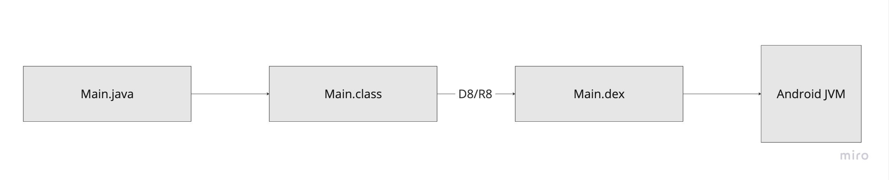
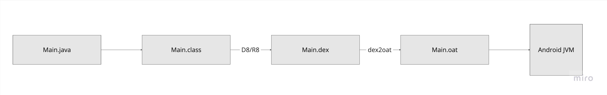

# JVM

JVM позволяет запускать байт-код на различных платформах. Достаточно написать JVM для конкретной платформы.

Байт-код - некая прослойка ассемблер-питон.

JVM умеет:

- поддержка многопоточности - есть стандартная библиотека для работы
- динамическая загрузка классов (класс загружается в момент необходимости). Работает через ClassLoader-ы. В андроид 2 основных класслоадера:
  - BootClassLoader - загружает части JDK
  - PathClassLoader - загружает приложение
- рефлексия - возможность работать с кодом не зная о нем никаких деталей. Например: через рефлексию можно получить все объявленные поля класса.
- JIT (just in time) компиляция. Если какой-то код часто выполняется, JVM может скомпилировать его в машинный код или как-то оптимизировать.
- Garbage Collection

Реализаций JVM много:

- HotSpot (часть OpenJDK)
- GraalVM
- Dalvik (android api < 21)
- Android Runtime (ART) (android api >= 21)

## Как код выполняется

Есть класс Main.java. Он преобразуется в Main.class - содержащий байткод. Далее, код этого класса исполняется на различных JVM.

Для андроид:

Обработка выполняется либо через D8, либо через R8.

- D8 - все классы попадают в один файл другого формата. Это позволяет уменьшить размер байт кода примерно в 2 раза.

- R8 - помимо того, что умеет D8, умеет обрезать лишнее - неиспользуемые методы

В одном .dex файле может быть не более 64000 методов. Ранее это было большой проблемой, но есть хак через multidex. Который через несколько ClassLoader-ов делал несколько .dex файлов. После перехода с Dalvik на ART, такой проблемы больше нет.

.dex компилируем в ahead of time. То-есть до того как он исполняется. Это происходит на этапе установки APK. Начиная с api > 24 этот процесс происходит в фоне. А для приложений с большим кол-вом установок, дополнительно производятся оптимизации через сервисы GooglePlay.
