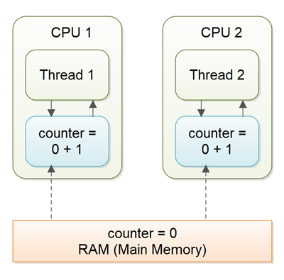

# Volatile

Ключевое слово `volatile` используется для обозначения переменной, как "хранящейся в основной памяти". Точнее, это означает, что каждое считывание переменной будет происходить из основной памяти компьютера, а не из регистров процессора, и что каждая запись в такую переменную будет записываться в основную память.

## Гарантия видимости

Ключевое слово Java volatile предназначено для решения проблем видимости переменных. При объявлении переменной счетчика volatile все записи в переменную счетчика будут немедленно записаны обратно в основную память. Кроме того, все операции чтения переменной counter будут считываться непосредственно из основной памяти.

Объявление переменной volatile, таким образом, гарантирует видимость для других потоков операций записи в эту переменную.

```Kotlin
public class SharedObject {

    public volatile int counter = 0;

}
```

В приведенном выше сценарии, где один поток (T1) изменяет счетчик, а другой поток (T2) считывает счетчик (но никогда не изменяет его), объявления переменной счетчика volatile достаточно, чтобы гарантировать видимость для T2 записей в переменную счетчика.

Однако, если бы и T1, и T2 увеличивали переменную счетчика, то объявления переменной счетчика volatile было бы недостаточно.

## Перестановка инструкций

JVM и CPU могут менять местами инструкции кода если это не изменяет код семантически.
Такое поведение может быть проблематичным, если одна из переменных помечена как `volatile`.

```Kotlin
public class MyClass {
    private int years;
    private int months
    private volatile int days;


    public void update(int years, int months, int days){
        this.years  = years;
        this.months = months;
        this.days   = days;
    }
}
```

При вызове метода update(), который обновляет значение переменной `days`, обновления переменных `years` и `months`, также будут переданы сразу в основную память. Однако, что если JVM поменяет инструкции местами:

```Kotlin
public void update(int years, int months, int days){
    this.days   = days;
    this.months = months;
    this.years  = years;
}
```

Значения `years` и `months` по-прежнему записываются в основную память при изменении переменной `days`, но на этот раз это происходит до того, как новые значения были записаны в months и years. Таким образом, новые значения не становятся должным образом видимыми для других потоков. Семантическое значение переупорядоченных инструкций изменилось.

## Happens before

Чтобы решить проблему переупорядочения инструкций, ключевое слово `volatile` дает гарантию **happens before** в дополнение к гарантии видимости. **Happens before** гарантирует, что:

- Операции чтения из других переменных и записи в них не могут быть переупорядочены таким образом, чтобы они выполнялись после записи в переменную `volatile`, если операции чтения / записи первоначально выполнялись до записи в переменную `volatile`.
- Операции чтения / записи перед записью в переменную `volatile` гарантированно "произойдут до" записи в переменную `volatile`. Обратите внимание, что все еще возможно, например, переупорядочить операции чтения / записи других переменных, расположенных после записи в `volatile`, до этой записи в `volatile`. Просто не наоборот. От "после" к "до" разрешено, но от "до" к "после" запрещено.
- Операции чтения из других переменных и записи в них не могут быть переупорядочены так, чтобы они выполнялись до считывания из `volatile` переменной, если операции чтения / записи первоначально выполнялись после считывания `volatile` переменной. Обратите внимание, что чтение других переменных, которые происходят до чтения переменной `volatile`, может быть переупорядочено так, чтобы оно происходило после чтения переменной `volatile`. Просто не наоборот. От "до" к "после" разрешено, но от "после" к "до" запрещено.

Описанное выше **happens before** поведение гарантирует, что гарантия видимости ключевого слова volatile соблюдается.

## Когда `volatile` недостаточно

Недостаточно, когда несколько потоков могут писать в переменную. В таком случае возникнет гонка состояний.



Например:

Чтение переменной и ее инкремент - не атомарные операции, поэтому 2 потока могут считать значение переменной из основной памяти до того, как один из потоков произведет инкремент.

## Когда `volatile` достаточно

Достаточно, когда только один поток обновляет значение переменной, а другие - читают.
